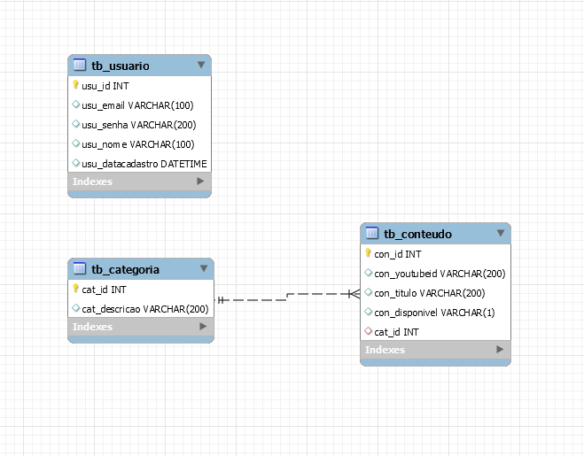

# Atividade 3 - Plataforma de Streaming

Crie um backend para uma plataforma de streaming que será consumida por uma aplicação frontend onde os usuários poderão assistir os conteúdos. A solução deve ser construída utilizando Node/Express.
Para simularmos um repositório de conteúdos vamos  utilizar o YouTube, mas ao serem cadastrados na nossa base de dados, nós iremos acrescentar algumas informações a mais, por exemplo: título, categoria e disponibilidade. <br>
Para fazer o gerenciamento de conteúdos (CRUD) nosso backend utilizará o seguinte modelo de banco de dados:



## Como cadastrar os conteúdos com vídeos do Youtube
A coluna con_youtubeid deverá armazenar o id do vídeo no YouTube, com esse id iremos conseguir gerar a imagem de capa do nosso conteúdo e também incorporar o vídeo quando o usuário clicar em ‘Assistir’. O id acima representa o parâmetro na url que o YouTube utiliza para disponibilizar os conteúdos em seu site. Por exemplo, veja seguinte URL abaixo:

https://www.youtube.com/watch?v=GDlkCkcIqTs
A rota /watch recebe via query string no parâmetro ‘v’ um valor. Esse valor (em negrito) é o id do nosso vídeo que será armazenado no nosso banco de dados.

https://i.ytimg.com/vi/[id]/hqdefault.jpg -> https://i.ytimg.com/vi/GDlkCkcIqTs/hqdefault.jpg
 
O YouTube também disponibiliza a URL para incorporação de vídeos, veja abaixo:

https://www.youtube.com/embed/[id]?autoplay=1 https://www.youtube.com/embed/GDlkCkcIqTs?autoplay=1

Com essa URL de incorporação, podemos utilizá-la na tag <iframe></iframe> do HTML, confira abaixo um exemplo de como ficaria o resultado final para que o vídeo seja exibido ao usuário:

<iframe width="560" height="315" allow='autoplay' src="https://www.youtube.com/embed/GDlkCkcIqTs?autoplay=1"</iframe>

## Endpoints a serem implementados
Para o gerenciamento de conteúdos a API deverá dispor dos seguintes endpoints:
- Consultar de conteúdos (/conteudos) [GET]
- Cadastrar conteúdo (/conteudos) [POST]
- Alterar conteúdo (/conteudos) [PUT]
- Deletar conteúdo (/conteudos/:id-exclusao) [DELETE]
- Obter um conteudo (/conteudos/:id-conteudo) [GET]

Além disso, outros endpoints devem ser implementados para:
- Consultar categorias (/categorias) [GET]
- Retornar HTML de vídeo incorporado (/conteudos/assistir/id-conteudo) [GET]
- Retornar HTML da imagem capa do vídeo (/conteudos/capa/id-conteudo) [GET]

A rota /assistir/id-conteudo deverá fazer o retorno de HTML com o link do vídeo no youtube. <br>
Exemplo:
```
res.setHeader('Content-Type', 'text/html')
res.send(`<iframe width="560" height="315" allow='autoplay' src="https://www.youtube.com/embed/GDlkCkcIqTs?autoplay=1"</iframe>`)
```
/conteudos/capa/id-conteudo
```
res.setHeader('Content-Type', 'text/html')
res.send(``)
```

Além disso, implemente também uma autenticação via JWT para proteger todos os endpoints. O token da nossa API deverá ser gerado através da rota /auth/token e retornado no corpo da resposta em uma propriedade chamada "chave".<br>
Exemplo:<br>
```
{
  chave: 12345  
}
```
O middleware deverá fazer a validação através do cabeçalho da requisição (Utilize a propriedade req.headers.authorization)

Todos esses endpoints deverão estar devidamente documentados em uma rota do sistema que deve se chamar /docs. A documentação deverá conter:</br>
- Tag </br>
- Sumário </br>
- Parâmetros </br>
- Códigos de retorno </br>
- Esquema de segurança (Autenticação)</br>
